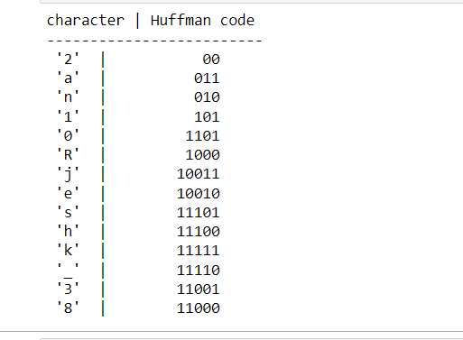

# Huffman-Coding
## Aim
To implement Huffman coding to compress the data using Python.

## Software Required
1. Anaconda - Python 3.7

## Algorithm:

### Step1:
Create the input String.

### Step2:
Create tree nodes.

### Step3:
Main function to implement huffman coding.
### Step4:
Calculate frequency of occurrence.

### Step5:
Print the characters and its huffmancode.


## Program:

                              NAME   : M.RAJESHKANNAN
                              REG NO : 212221230081
### Create the input String
```
string = 'Rajeshkannan_212221230081'
```
### Create tree nodes
```
class Nodetree(object):
    def __init__(self,left=None,right=None):
        self.left= left
        self.right =right
    def children(self):
        return(self.left, self.right) 
```


### Main function to implement huffman coding
```
def huffman_coding(Tree,left =True,binString=''):
    if type(Tree) is str:
        return {Tree : binString}
    (l, r) = Tree.children()
    d = dict()
    d.update(huffman_coding(l,True,binString+ '0'))
    d.update(huffman_coding(r,False,binString+ '1'))
    return d


```
### Calculate frequency of occurrence
```
freq ={}
for i in string:
    if i in freq:
        freq[i]+=1
    else:
        freq[i]=1
freq = sorted(freq.items(),key=lambda x:x[1] ,reverse = True)
print(freq)
```
### Create tree structure for huffman coding
```
nodes = freq
while len(nodes) >1:
    (key1 , value1 ) = nodes[-1]
    (key2 , value2 ) = nodes[-2]
    nodes = nodes[:-2]
    Tree = Nodetree(key1,key2)
    nodes.append((Tree , value1+value2))
    nodes = sorted(nodes, key =lambda x:x[1],reverse =True)

```
### Print the characters and its huffmancode

```
huffman = huffman_coding(nodes[0][0])
print('character | Huffman code')
print('-------------------------')
for (char , frequency) in freq:
    print(' %-4r | %12s ' %(char, huffman[char]))

```
## Output:

### Print the characters and its huffmancode




## Result
Thus the huffman coding was implemented to compress the data using python programming.
